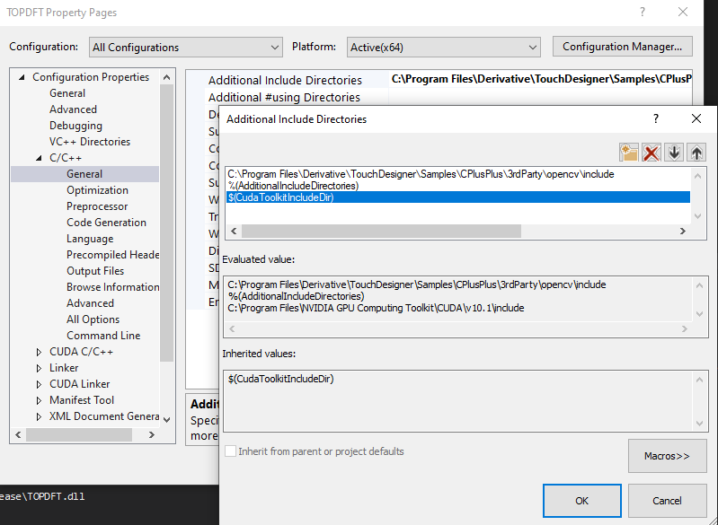
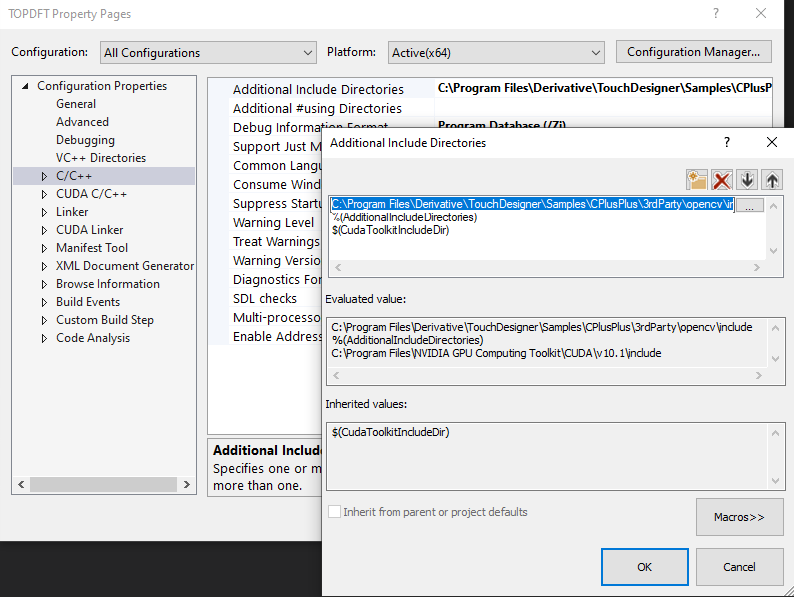
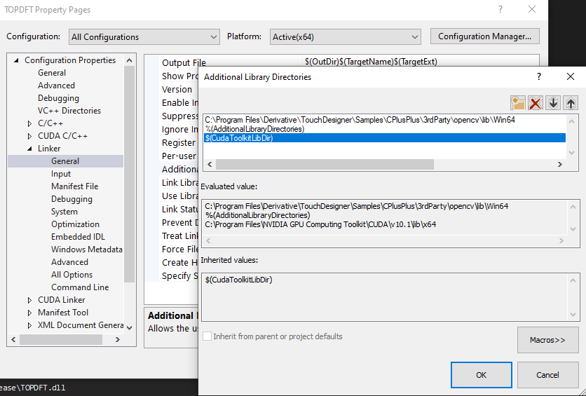

## Compiling Custom Operators

This text should be a small guide to getting started with compiling custom operators that can be found on github or elsewhere as pure source code. Often setting up your environment is the most difficult step followed by making accessible all libraries that might be necessary for successfully compiling other’s projects.

During the first half of 2020, Derivative had Gabriel Robels as a coop student work on a set of custom operators that we hope can be a starting point for anybody including members of the community only starting with c++ development.

A collection of these operators can be found in the Samples/CPlusPlus folder of the TouchDesigner Installation. Others, which depend on more external libraries can be found on the Derivative github here: [https://github.com/TouchDesigner](https://github.com/TouchDesigner)


#### Installing Visual Studio Community Edition


*   Download the latest Visual Studio Community Edition from: [https://visualstudio.microsoft.com/vs/community/](https://visualstudio.microsoft.com/vs/community/)
*   Start the installation process
*   In the Installer, select “Desktop Development with C++” and proceed with the installation process

#### 
    

<p id="gdcalert1" ><span style="color: red; font-weight: bold">>>>>>  gd2md-html alert: inline image link here (to images/image1.png). Store image on your image server and adjust path/filename/extension if necessary. </span><br>(<a href="#">Back to top</a>)(<a href="#gdcalert2">Next alert</a>)<br><span style="color: red; font-weight: bold">>>>>> </span></p>


#### Installing the CUDA Toolkit

_For some of the projects a CUDA Development environment is required. Which version much depends on the TouchDesigner version the operator is targeted at. Check [https://docs.derivative.ca/CUDA](https://docs.derivative.ca/CUDA) for more information._


*   Download the CUDA Toolkit from here: [https://developer.nvidia.com/cuda-toolkit](https://developer.nvidia.com/cuda-toolkit) . Legacy versions of the CUDA Toolkit can be found here: [https://developer.nvidia.com/cuda-toolkit-archive](https://developer.nvidia.com/cuda-toolkit-archive)
*   During installation choose “Custom” and **be careful to only select the CUDA component.** The other options will install most likely outdated driver components.

    

<p id="gdcalert2" ><span style="color: red; font-weight: bold">>>>>>  gd2md-html alert: inline image link here (to images/image2.png). Store image on your image server and adjust path/filename/extension if necessary. </span><br>(<a href="#">Back to top</a>)(<a href="#gdcalert3">Next alert</a>)<br><span style="color: red; font-weight: bold">>>>>> </span></p>


##### 


##### Referencing CUDA libraries


*   After loading a project in Visual Studio, open the Project’s Properties via the Project>Properties or by hitting Alt+F7
*   Make sure to set the “Configuration“ Dropdown to “All Configurations”
*   In the Configuration Properties, navigate to C/C++ and edit the “Additional Include Directories” to make sure the value to the CUDA toolkit, $(CudaToolkitIncludeDir), is present.


<p id="gdcalert3" ><span style="color: red; font-weight: bold">>>>>>  gd2md-html alert: inline image link here (to images/image3.png). Store image on your image server and adjust path/filename/extension if necessary. </span><br>(<a href="#">Back to top</a>)(<a href="#gdcalert4">Next alert</a>)<br><span style="color: red; font-weight: bold">>>>>> </span></p>


*   In the Configuration Properties, navigate to Linker and edit the “Additional Library Directories” to make sure the value to the CUDA toolkit, $(CudaToolkitIncludeDir), is present.


<p id="gdcalert4" ><span style="color: red; font-weight: bold">>>>>>  gd2md-html alert: inline image link here (to images/image4.png). Store image on your image server and adjust path/filename/extension if necessary. </span><br>(<a href="#">Back to top</a>)(<a href="#gdcalert5">Next alert</a>)<br><span style="color: red; font-weight: bold">>>>>> </span></p>


##### Specifying the Nvidia GPUs to generate Code for


*   In the Configuration Properties, navigate to CUDA C/C++ and edit the “Code Generation” entry to include all NVIDIA architectures to compile code for. 
*   For a reference on GPU compilation and virtual as well as gpu features, please refer to [https://docs.nvidia.com/cuda/archive/10.2/cuda-compiler-driver-nvcc/index.html#virtual-architectures](https://docs.nvidia.com/cuda/archive/10.2/cuda-compiler-driver-nvcc/index.html#virtual-architectures)
*   For best performance, when omitting older architectures, specify _compute_xx,compute_xx_ for each omitted architecture. To support all future architecture, also add an additional _compute_xx,compute_xx_ entry for the newest architecture. Here _xx_ is referring to the 2 digit hardware architecture identifier.


<p id="gdcalert5" ><span style="color: red; font-weight: bold">>>>>>  gd2md-html alert: inline image link here (to images/image5.png). Store image on your image server and adjust path/filename/extension if necessary. </span><br>(<a href="#">Back to top</a>)(<a href="#gdcalert6">Next alert</a>)<br><span style="color: red; font-weight: bold">>>>>> </span></p>


*   


#### Referencing openCV libraries

_Some projects make use of various openCV modules. Which openCV release is required depends on the version used by the creator. Since TouchDesigner 2020.40k openCV 4.5’s libraries are included in the TouchDesigner Installfolder at Samples\CPlusPlus\3rdParty_


##### Using the included libraries for openCV 4.5


*   After loading a project in Visual Studio, open the Project’s Properties via the Project>Properties or by hitting Alt+F7
*   Make sure to set the “Configuration“ Dropdown to “All Configurations”
*   In the Configuration Properties, navigate to C/C++ and edit the “Additional Include Directories” to include the path to the folder containing the openCV includes. For a default TouchDesigner installation this would be: C:\Program Files\Derivative\TouchDesigner\Samples\CPlusPlus\3rdParty\opencv\include


<p id="gdcalert6" ><span style="color: red; font-weight: bold">>>>>>  gd2md-html alert: inline image link here (to images/image6.png). Store image on your image server and adjust path/filename/extension if necessary. </span><br>(<a href="#">Back to top</a>)(<a href="#gdcalert7">Next alert</a>)<br><span style="color: red; font-weight: bold">>>>>> </span></p>





*   Still in the Configuration Properties, navigate to Linker and edit the “Additional Library Directories” to include the path to the folder containing the openCV libraries. For a default TouchDesigner installation this would be: C:\Program Files\Derivative\TouchDesigner\Samples\CPlusPlus\3rdParty\opencv\lib\Win64

    

<p id="gdcalert7" ><span style="color: red; font-weight: bold">>>>>>  gd2md-html alert: inline image link here (to images/image7.png). Store image on your image server and adjust path/filename/extension if necessary. </span><br>(<a href="#">Back to top</a>)(<a href="#gdcalert8">Next alert</a>)<br><span style="color: red; font-weight: bold">>>>>> </span></p>





*   Finally, make sure that all required libraries are correctly referenced under the Linker/Input section. Add any missing libraries to the list under “Additional Dependencies”.

    

<p id="gdcalert8" ><span style="color: red; font-weight: bold">>>>>>  gd2md-html alert: inline image link here (to images/image8.png). Store image on your image server and adjust path/filename/extension if necessary. </span><br>(<a href="#">Back to top</a>)(<a href="#gdcalert9">Next alert</a>)<br><span style="color: red; font-weight: bold">>>>>> </span></p>





##### 


##### 
    Using external openCV libraries


*   Download the precompiled version of the openCV windows libraries from here: [https://github.com/opencv/opencv/releases](https://github.com/opencv/opencv/releases) - there are self extracting archives available 
*   Extract to a location on your computer
*   After loading a project in Visual Studio, open the Project’s Properties via the Project>Properties or by hitting Alt+F7
*   In the Configuration Properties, navigate to C/C++ and edit the “Additional Include Directories” to include the path to the folder containing the openCV libraries

<p id="gdcalert9" ><span style="color: red; font-weight: bold">>>>>>  gd2md-html alert: inline image link here (to images/image9.png). Store image on your image server and adjust path/filename/extension if necessary. </span><br>(<a href="#">Back to top</a>)(<a href="#gdcalert10">Next alert</a>)<br><span style="color: red; font-weight: bold">>>>>> </span></p>


#### 


#### Compiling openCV with CUDA support


    _Some other projects require the openCV windows libraries with CUDA modules included, yet as the available pre-built versions do not offer this support, openCV has to be recompiled with the required CUDA modules enabled. A good guide to follow can be found here: [https://jamesbowley.co.uk/accelerate-opencv-4-3-0-build-with-cuda-and-python-bindings/](https://jamesbowley.co.uk/accelerate-opencv-4-3-0-build-with-cuda-and-python-bindings/)_


##### Prerequisites


*   Visual Studio (using _Visual Studio 2019_ in this example)
*   The sources for o[penCV](https://github.com/opencv/opencv) and o[penCV Contrib](https://github.com/opencv/opencv_contrib)
*   [CMake](https://cmake.org/download/)
*   

<p id="gdcalert10" ><span style="color: red; font-weight: bold">>>>>>  gd2md-html alert: undefined internal link (link text: "CUDA Toolkit"). Did you generate a TOC? </span><br>(<a href="#">Back to top</a>)(<a href="#gdcalert11">Next alert</a>)<br><span style="color: red; font-weight: bold">>>>>> </span></p>

[CUDA Toolkit](#heading=h.9mbcp7kdt79t)
*   _Optional:_ for video decoding on the gpu - [Nvidia Video Codec SDK](https://developer.nvidia.com/nvidia-video-codec-sdk)
    *   Extract and copy the **include** and **Lib** directories to your CUDA installation
*   Optional: for DNN CUDA backend support - [cuDNN](https://developer.nvidia.com/rdp/form/cudnn-download-survey)
    *   Extract and copy the **bin**,** include** and **Lib** directories to your CUDA installation

##### 
    Generating openCV build files with CMake


The original instructions ask for running everything in a Command Prompt, arguably it’s easier to create a .bat file.


*   create a .bat file and open it in your editor:

        ```
        set "openCvSource=PATH_TO_OPENCV_SOURCE"
        set "openCVExtraModules=PATH_TO_OPENCV_CONTRIB_MODULES"
        set "openCvBuild=%openCvSource%\build"
        set "buildType=Release"
        set "generator=Visual Studio 16 2019"
"C:\Program Files\CMake\bin\cmake.exe" -B"%openCvBuild%/" -H"%openCvSource%/" -G"%generator%" -DCMAKE_BUILD_TYPE=%buildType% -DOPENCV_EXTRA_MODULES_PATH="%openCVExtraModules%/" -DINSTALL_TESTS=ON -DINSTALL_C_EXAMPLES=ON -DBUILD_EXAMPLES=ON -DBUILD_opencv_world=ON -DWITH_CUDA=ON -DCUDA_TOOLKIT_ROOT_DIR="C:/Program Files/NVIDIA GPU Computing Toolkit/CUDA/v10.2" -DCUDA_FAST_MATH=ON -DWITH_CUBLAS=ON -DCUDA_ARCH_PTX=7.5 -DWITH_NVCUVID=ON -DWITH_OPENGL=ON -DWITH_MFX=ON
        ```


*   run the bat file in a Terminal or Command Prompt
*   make changes to the configuration as required using the CMake GUI
*   open the OpenCV.sln in Visual Studio
*   In the **Solution Explorer**, expand **CMakeTargets **and right click on **Install**, selecting **Build**

**Note:** During the process of generating the build files with CMake, an error can occur when running on a ExFAT filesystem: 


```
        CMake Error: Problem extracting tar: e:/git/opencv/.cache/ippicv/879741a7946b814455eee6c6ffde2984-ippicv_2020_win_intel64_20191018_general.zip
        CMake Error at cmake/OpenCVDownload.cmake:240 (message):
         IPPICV: Unpack failed: 1
```


This can be resolved by using 7zip as explained here: [https://stackoverflow.com/a/61489779](https://stackoverflow.com/a/61489779)
