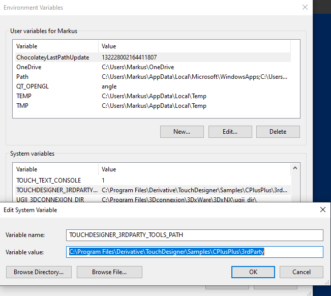

# Custom Operator Samples

We hope these custom operators can be a starting point to developing for anybody including members of the community only beginning with c++ development.

A collection of these operators can be found in the Samples/CPlusPlus folder of the TouchDesigner Installation. Others, which depend on more external libraries can be found on the Derivative github here: [https://github.com/TouchDesigner](https://github.com/TouchDesigner)

For discussions around this repository, please use our [forum](https://forum.derivative.ca).

> Tip: You can kick-start your custom operators projects by using the Cpp Pars Template Generator (cppParsTemplateGen) available in TouchDesigner's Palette to generate a Parameters class that will mimic the custom parameters of a reference COMP. For more informations, please [visit the wiki](https://docs.derivative.ca/Palette:cppParsTemplateGeni).

* [List of Operators](#Operators)
* [Compiling Custom Operators](#Compiling-Custom-Operators)
  * [Installing Visual Studio](#Installing-Visual-Studio-Community-Edition)
  * [Installing CUDA Toolkit](#Installing-the-CUDA-Toolkit)
    * [Reference CUDA in VS](#Referencing-CUDA-libraries)
  * [Referencing openCV in VS](#Referencing-openCV-libraries)
    * [Using external openCV libraries](#Using-external-openCV-libraries)
* [Compiling openCV with CUDA support](#Compiling-openCV-with-CUDA-support)
  * [Prerequisites](#Prerequisites)
  * [Create openCV build files](#Generating-openCV-build-files-with-CMake)
* [CUDA and NVIDIA hardware compatability](#Specifying-the-Nvidia-GPUs-to-generate-Code-for)
* [Fixes for openCV or CUDA version updates](#Fixes-for-openCV-or-CUDA-version-updates)
* [Loading Custom Operators in TouchDesigner](#Loading-Custom-Operators-in-TouchDesigner)

## Operators

* **TOP Family**
  * [FilterTOP](TOP/BasicFilterTOP)
  * [CPUMemoryTOP](TOP/CPUMemoryTOP)
  * [CannyEdgeTOP](TOP/CannyEdgeTOP)
  * [ContoursTOP](TOP/ContoursTOP)
  * [CudaTOP](TOP/CudaTOP)
  * [DistanceTransformTOP](TOP/DistanceTransformTOP)
  * [ObjectDetectorTOP](TOP/ObjectDetectorTOP)
  * [OpenGLTOP](TOP/OpenGLTOP)
  * [OpticalFlowCPUTOP](TOP/OpticalFlowCPUTOP)
  * [OpticalFlowGPUTOP](TOP/OpticalFlowGPUTOP)
  * [SpectrumTOP](TOP/SpectrumTOP)
* **CHOP Family**
  * [FilterCHOP](CHOP/BasicFilterCHOP)
  * [GeneratorCHOP](CHOP/BasicGeneratorCHOP)
  * [OneEuroCHOP](CHOP/OneEuroCHOP)
  * [TimesliceFilterCHOP](CHOP/TimeSliceFilterCHOP)
  * [TimesliceGeneratorCHOP](CHOP/TimeSliceGeneratorCHOP)
* **SOP Family**
  * [FilterSOP](SOP/FilterSOP)
  * [GeneratorSOP](SOP/GeneratorSOP)
  * [IntersectPointsSOP](SOP/IntersectPointsSOP)
  * [SpiralSOP](SOP/SpiralSOP)
  * [SprinkleSOP](SOP/SprinkleSOP)
  * [WrapPointsSOP](SOP/WrapPointsSOP)
* **DAT Family**
  * [FilterDAT](DAT/FilterDAT)
  * [GeneratorDAT](DAT/GeneratorDAT)
  
## Compiling Custom Operators

This text should be a small guide to getting started with compiling custom operators that can be found on github or elsewhere as pure source code. Often setting up your environment is the most difficult step followed by making accessible all libraries that might be necessary for successfully compiling other’s projects.

### Installing Visual Studio Community Edition

*   Download the latest Visual Studio Community Edition from: [https://visualstudio.microsoft.com/vs/community/](https://visualstudio.microsoft.com/vs/community/)
*   Start the installation process
*   In the Installer, select “Desktop Development with C++” and proceed with the installation process


### Installing the CUDA Toolkit

_For some of the projects a CUDA Development environment is required. Which version much depends on the TouchDesigner version the operator is targeted at. Check [https://docs.derivative.ca/CUDA](https://docs.derivative.ca/CUDA) for more information._

*   Download the CUDA Toolkit from here: [https://developer.nvidia.com/cuda-toolkit](https://developer.nvidia.com/cuda-toolkit) . Legacy versions of the CUDA Toolkit can be found here: [https://developer.nvidia.com/cuda-toolkit-archive](https://developer.nvidia.com/cuda-toolkit-archive)
*   During installation choose “Custom” and **be careful to only select the CUDA component.** The other options will install most likely outdated driver components.


#### Referencing CUDA libraries

*   After loading a project in Visual Studio, open the Project’s Properties via the Project>Properties or by hitting Alt+F7
*   Make sure to set the “Configuration“ Dropdown to “All Configurations”
*   In the Configuration Properties, navigate to C/C++ and edit the “Additional Include Directories” to make sure the value to the CUDA toolkit, $(CudaToolkitIncludeDir), is present.

")

*   Still in the Configuration Properties, navigate to Linker and edit the “Additional Library Directories” to make sure the value to the CUDA toolkit, $(CudaToolkitIncludeDir), is present.

")

### Referencing openCV libraries

_Some projects make use of various openCV modules. Which openCV release is required depends on the version used by the creator. Since TouchDesigner 2020.44130, openCV 4.5’s libraries are included in the TouchDesigner Installfolder at Samples\CPlusPlus\3rdParty_. The solutions using openCV require an environmental variable called **TOUCHDESIGNER_3RDPARTY_TOOLS_PATH** which should point to the before mentioned _3rdParty_ path. Before building, add this variable via Windows' _System Properties_ dialog. 



#### Using external openCV libraries

If you want to use a different openCV version, you can follow these instructions. If you additionally need CUDA support, follow instructions [below](#Compiling-openCV-with-CUDA-support) to compile openCV with CUDA support.

*   Download the precompiled version of the openCV windows libraries from here: [https://github.com/opencv/opencv/releases](https://github.com/opencv/opencv/releases) - there are self extracting archives available 
*   Extract to a location on your computer
*   After loading a project in Visual Studio, open the Project’s Properties via the Project>Properties or by hitting Alt+F7
*   In the Configuration Properties, navigate to C/C++ and edit the “Additional Include Directories” to include the path to the folder containing the openCV libraries


*   Still in the Configuration Properties, navigate to Linker and edit the “Additional Library Directories” to include the path to the folder containing the openCV libraries. 


*   Finally, make sure that all required libraries are correctly referenced under the Linker/Input section. Add any missing libraries to the list under “Additional Dependencies”.


**Note:** By default, the binaries and libs shipped with TouchDesigner are "Release" binaries. The examples of this repository might fail to compile in the Debug configuration of Visual Studio. If you wish to compile with debug features, you should manually compile OpenCV with CUDA.

## Compiling openCV with CUDA support (Not necessary for building these examples.)

**Note:** This is not necessary for compiling these operators - in fact TouchDesigner comes with all necessary binaries precompiled. We'll leave this guide here as the instructions were hard to find initialy.

_Some other projects require the openCV windows libraries with CUDA modules included, yet as the available pre-built versions do not offer this support, openCV has to be recompiled with the required CUDA modules enabled. A good guide to follow can be found here: [https://jamesbowley.co.uk/accelerate-opencv-4-3-0-build-with-cuda-and-python-bindings/](https://jamesbowley.co.uk/accelerate-opencv-4-3-0-build-with-cuda-and-python-bindings/)_

### Prerequisites

*   Visual Studio (using _Visual Studio 2019_ in this example)
*   The sources for [openCV](https://github.com/opencv/opencv) and [openCV Contrib](https://github.com/opencv/opencv_contrib)
*   [CMake](https://cmake.org/download/)
*   [CUDA Toolkit](https://developer.nvidia.com/cuda-toolkit)
*   _Optional:_ for video decoding on the gpu - [Nvidia Video Codec SDK](https://developer.nvidia.com/nvidia-video-codec-sdk)
*   Extract and copy the contents of the **Interface** directory to the **include** directory and the **Lib** directory to the **lib** directory inside your CUDA installation.
*   _Optional:_ for DNN CUDA backend support - [cuDNN](https://developer.nvidia.com/rdp/form/cudnn-download-survey)
*   Extract and copy the **bin**, **include** and **Lib** directories to your CUDA installation

### Generating openCV build files with CMake

The original instructions ask for running everything in a Command Prompt, arguably it’s easier to create a .bat file.

*   create a .bat file and open it in your editor:

```
set "openCvSource=PATH_TO_OPENCV_SOURCE"
set "openCVExtraModules=PATH_TO_OPENCV_CONTRIB_MODULES"
set "openCvBuild=%openCvSource%\build"
set "buildType=Release"
set "generator=Visual Studio 16 2019"
"C:\Program Files\CMake\bin\cmake.exe" -B"%openCvBuild%/" -H"%openCvSource%/" -G"%generator%" -DCMAKE_BUILD_TYPE=%buildType% -DOPENCV_EXTRA_MODULES_PATH="%openCVExtraModules%/" -DINSTALL_TESTS=ON -DINSTALL_C_EXAMPLES=ON -DBUILD_EXAMPLES=ON -DBUILD_opencv_world=ON -DWITH_CUDA=ON -DCUDA_TOOLKIT_ROOT_DIR="C:/Program Files/NVIDIA GPU Computing Toolkit/CUDA/v10.2" -DCUDA_FAST_MATH=ON -DWITH_CUBLAS=ON -DCUDA_ARCH_PTX=7.5 -DWITH_NVCUVID=ON -DWITH_OPENGL=ON -DWITH_MFX=ON
```

*   run the bat file in a Terminal or Command Prompt
*   make changes to the configuration as required using the CMake GUI
*   open the OpenCV.sln in Visual Studio
*   In the **Solution Explorer**, expand **CMakeTargets** and right click on **Install**, selecting **Build**

**Note:** During the process of generating the build files with CMake, an error can occur when running on a ExFAT filesystem: 

```
CMake Error: Problem extracting tar: e:/git/opencv/.cache/ippicv/879741a7946b814455eee6c6ffde2984-ippicv_2020_win_intel64_20191018_general.zip
CMake Error at cmake/OpenCVDownload.cmake:240 (message):
IPPICV: Unpack failed: 1
```

This can be resolved by using 7zip as explained here: [https://stackoverflow.com/a/61489779](https://stackoverflow.com/a/61489779)

## Specifying the Nvidia GPUs to generate Code for

Projects in this repositroy are setup to support all previous and future gpu hardware by compiling for virtual support for any pre pascal hardware and any post turing hardware. To make changes to this configuration:

*   In the Configuration Properties, navigate to CUDA C/C++ and edit the “Code Generation” entry to include all NVIDIA architectures to compile code for. 
*   For a reference on GPU compilation and virtual as well as gpu features, please refer to [https://docs.nvidia.com/cuda/archive/10.2/cuda-compiler-driver-nvcc/index.html#virtual-architectures](https://docs.nvidia.com/cuda/archive/10.2/cuda-compiler-driver-nvcc/index.html#virtual-architectures)
*   For best performance, when omitting older architectures, specify _compute_xx,compute_xx_ for each omitted architecture. To support all future architecture, also add an additional _compute_xx,compute_xx_ entry for the newest architecture. Here _xx_ is referring to the 2 digit hardware architecture identifier.


## Fixes for openCV or CUDA version updates

Some newer TouchDesigner Versions might be delivered with an updated openCV and/or require a newer CUDA Version. In this case it is easiest to edit the solutions `*.vcxproj` file. The files are XML strucutred.

### change the openCV version

Open the `*.vcxproj` file in a texteditor and search for the xml node `<AdditionalDependencies>`. In the value, there should be something like `opencv_world451.lib`.Change this file to the file available in your TouchDesigner install folder under `Samples/CPlusPlus/3rdParty/opencv/lib/Win64`. For example openCV version 4.5 would reference `opencv_world450.lib` while openCV version 4.5.1 would have to reference `opencv_world451.lib`.
There should be at least 2 sections in the file where this is referenecd, once under `Debug` and once under `Release`.

### change the CUDA version

open the `*.vcxproj` file in a texteditor and search for an xml node similar to `<Import Project="$(VCTargetsPath)\BuildCustomizations\CUDA 11.2.props" />`. Here change the version to the one currently used by your TouchDesigner build. This will have to be done in 2 places.

## Loading Custom Operators in TouchDesigner

Please refer to the documentation [here](https://docs.derivative.ca/Custom_Operators#Using_Custom_OPs_-_Plugin_Folder_Locations)

**Note:** When compiling custom operators with a custom version of OpenCV (with or without CUDA) or other dependencies, you will need to place those dependencies next to your custom cpp operator .dlls
